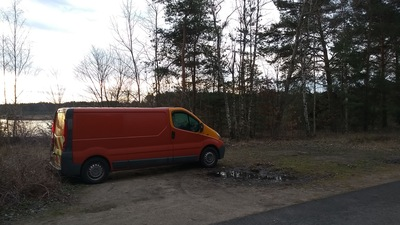
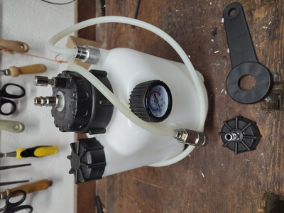
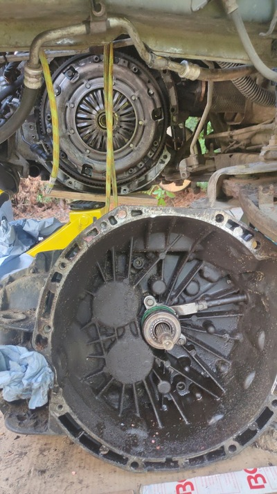

# Van-Clutch-Slave-Cylinder-Replacement
A story about me fixing a van

The star of our story is a Vauxhall Vivaro A 2.0L from 2012. I bought it in 2018 for 4200 GBP, it was an ex fleet vehicle, I converted it to a simple modular camper - which is also a different story about my views on design.

The reason I'm telling you the story is to showcase my ability as a mechanic, this being the most challenging such project I have done, and in case you're wondering why my GitHub calendar isn't all green - it's because I was outdoors.

The van is actually made by Renault and sold by them as the Trafic, Opel, Vauxhall sell it as the Vivaro and Nissan sells it as the Primastar. Badge engineering being an interesting topic in itself, but not for right now.

I had previously done a bunch of work on this van and wanted to extend its life as much as possible. Compact vans are really not meant to be worked on, they are fleet vehicles and are meant to get to the end of their useful life and then simply be sold and / or disposed of. There is very little space to work on the large diesel engine and on this vehicle at least, accessibility for maintenance was not a high priority, although it was at no point impossible or totally absurd, just very frustrating as in 'first drain the coolant' type of inconvenience.

Diagnosis of the problem was largely me being pretty sure what was wrong but not wanting to have to drop the transmission and therefore making completely sure to eliminate anything else it could possibly be. We're of course talking about a soft clutch with a low and lowering bite point. I checked everything, replaced the master cylinder, replaced the rubber hoses, made sure everything was tight. Bled the system multiple times of course.

I'm not a professional mechanic although I have done work for beer. I don't have all the tools, you need to bleed the clutch on this vehicle by pressing hydraulic fluid (DOT 4, glycol) from above. In case you're really interested, the English Vauxhall is a Right Hand Drive Van, built under license from Renault who of course imagined it as a Left Hand Drive vehicle. The routing of the pipes is therefore a bit shonky on the RHD van, which leads to air locks that are only alleviated by oil from above.
I went down to the local car parts place, they had something for me for €400; I politely declined their offer. The next day a €30 contraption came. The hand pump didn't quite work (flap valve integrated into cylinder - not quite sealing) so I modified it with a compressor quick connect.
You can imagine the device, it's basically a garden sprayer with a quick connect for a special brake/clutch reservoir lid.

That's good - we've saved €370 already, and the modification took roughly as long as the trip to the shop.

Of course, as you know, bleeding the system doesn't fix the problem because the slave cylinder is gone. The Vivaro has a concentric slave cylinder, which means you have to remove the transmission to replace it.
Interesting thing is, the part costs less than €50, and actually replacing it is trivial - but the work to get to that point is abundant and difficult.

I had called around several garages that I knew, and various self help places where you can rent floor space. You're looking at €100 per hour here for the garage and the cheapest place to rent, just floor and roof, no tools, no lift €25/hr!!
Bearing in mind this job takes about 8 hours if everything goes smoothly, garage would cost €800 and up, I decide to go for it myself.
Now, I have a jack and axle stands, I don't have a lift or a pit. It's not that big an engine! I'll be able to lift the transmission back on by hand, right?

Typically handheld tools are not a problem with automotive - you can buy whatever you need and still save bags of money. Specialist tooling, alternator tools or manometers, for example, used to cost a lot but there has been a period where they are available cheaply to buy from China, which has been wonderful and helpful. I find it confusing and disappointing that they're not really available to borrow locally. I guess most people mistreat tools so it's not common practice to lend them.

Being very serious, I'm going to get underneath the vehicle, change its centre of gravity and yank stuff around, so it needs to be lifted safely. I have two axle stands and two backup axle stands to catch the vehicle should something fail. They are all rated higher than necessary for this work, they are checked, double checked and then glanced at nervously to ensure they are still in place and bearing the load without any trouble throughout the process.
People do die from improperly lifted vehicles and such a death would be, among other things, incredibly embarrassing.

If you wish to replace the clutch slave cylinder, you must first remove the entire front of the vehicle.
This means grill, bodywork, headlights, airbox, air induction pipes, drop the coolant, label and remove coolant pipes, remove various metalwork, displace radiator. The nice thing about a van is you can store all this stuff in the back.
Additionally both front wheels, displace suspension, remove both drive axles...
A bearing on the right hand side axle was stuck - really stuck - it was possible to remove the mount. 'possible'.
This is the point where the videos and Haynes Manual stop being helpful.

There are a lot of wires and pipes around the transmission bell so there's some work to displace them, they're obviously made as short as possible to save weight and cost so it's a bit tricky.
The sub frame stops the transmission from dropping straight down so you have to lay under it, slide it off the axle and then roll it out and around the subframe. My skepticism about the utility of pushups and the bench press as training modalities for real life work was suddenly reduced at this moment.

As I said, actually replacing the cylinder is trivial. You just clean it, replace the cylinder, replace the clutch pack, centre it with the centring tool, tighten it up. Jobs a good one - maybe 15 mins. You definitely don't want to have to do this again though so triple check with a friend.

I had of course asked a dear friend for advice about doing this job - he told me "It's not that bad" - not having realised I'm doing this in a driveway with very basic lifting equipment. My lack of engine crane was compensated for with a bit of 8mm climbing rope hung from an engine mount, the magic of mechanical advantage using a single pulley, a lot of sweat and foul language, a friend with an endoscope observing the input shaft passing through the clutch bearing (and forgetting to remove the endoscope - but it survived) and the absolute refusal to fail at this point.

So at this point, "reassembly is the reverse of disassembly" (if you know, you know). It worked. Nailed it, big pride, quite a serious job, fairly difficult constraints.

I did later get an OBDII error code which I tracked down to a broken connector (collateral damage from transmission wrestling) on an accessory EGR / AGV coolant pump which is not available as spare and I basically had to take apart, solder on to and rebuild. Works.

Vehicle works again, probably €800 in the pocket that wouldn't have been there otherwise and some pretty valuable and interesting experience gained.

The total cost for parts; clutch pack, clutch bearing, DOT4, transmission seal was €244,21 - which is a sunk cost anyway and probably cheaper than it would have been with the garage markup.
I bought a large low profile 3T hydraulic jack (returned Vevor) for €150 and a pair of 3T jack stands for €25. Those things last forever (this jack is actually fully serviceable) so I don't really know how you count that expenditure. Probably one of those things that ten years from now you don't regret buying at a discount. The business economics discussion is one that gets had in a nice, clean, well lit environment and that's why, to me, it just doesn't capture the reason why you need effective, reliable tools.
It's a conversation I find very interesting; is it worth me doing the job myself? If you count the time - probably not, marginal at best. If you count the learning - I mean what would a mechanics course up to this level cost? Is it even a thing if you're not in the trade? If you count the downtime of the vehicle?
I haven't really figured it out and I like twisting spanners so it can be written off as type 2 fun.

The cool thing about this vehicle is that it's old, it's cheap, if I break it I won't be that upset - and it's been a great learning platform.
Worst case (other than injury) is I have to pay for it to be towed and crushed into a cube.

On this vehicle the injectors eventually fail and it's basically not possible to pull them to replace them, even with the engine out. So it basically means an engine swap. When the turbocharger stopped working about a year later I wasn't able to access it directly, it's an engine out job and that was the end of this vehicle for me.

I spent at least 20 hours doing the clutch and I never want to do that job again. So maybe I won, maybe I lost. But sometimes you have to do the work. It's crazy to throw away the whole machine for a broken €50 part and at some point you're working on a machine that really is worth a lot. 
If you're a farmer, you need to get the machine working now or you're doing the whole lot by hand. If you're a sailor, you need to get the machine working for the sake of the souls on board.
The challenge came my way, I rose to it and it taught me something. Steel is heavy.
